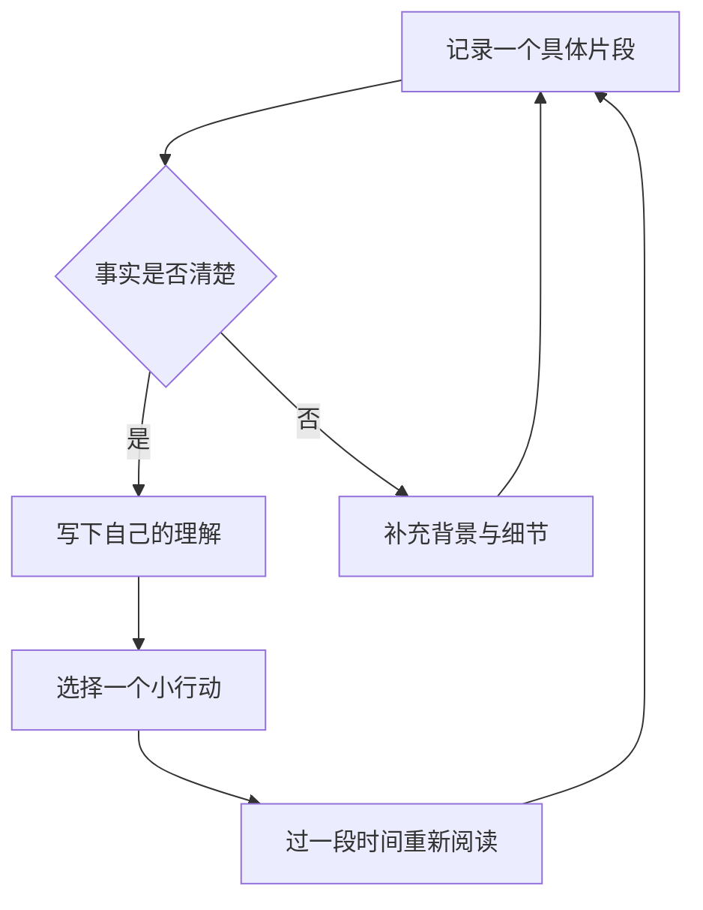
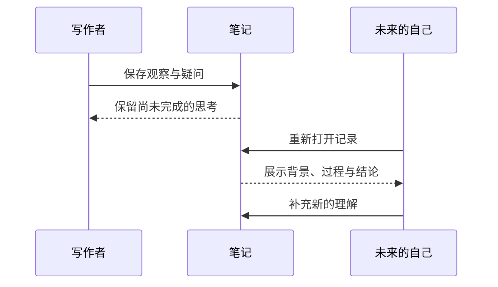
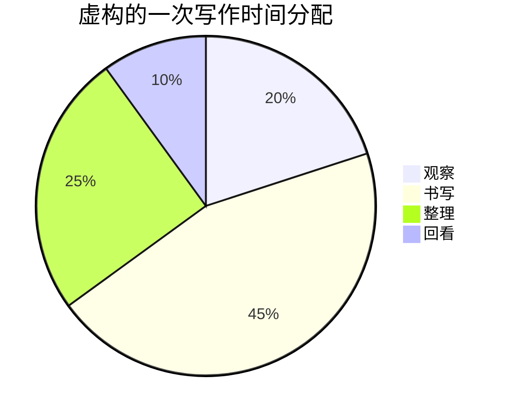

# 把日常写成可以重读的文字

一篇关于观察、记录与理解的中文长文，也是一次 Obsidian 内容排版巡检。

> [!abstract] 使用这篇样稿
> 建议先完整阅读前两节，再检查列表、表格和嵌入。分别切换**阅读视图、实时预览、源码模式**，调整窗口宽度，并试一下深色模式。文中的故事和数值均为虚构测试材料；复选框供你实际勾选。
>
> 本文覆盖主要原生 Markdown 内容，以及本地媒体、Bases、Canvas 等扩展展示面。社区插件没有统一的“全量”语法，本文不依赖 Dataview、Tasks 或 Excalidraw。

## 导航

[[#一、清晨的一页：长段落与阅读节奏|长文阅读]] · [[#二、把注意力放回文字：混排与强调|中文混排]] · [[#三、从观察到行动：列表专项|列表专项]] · [[#四、留出另一种声音：引用与提示|引用与提示]] · [[#五、整理差异：表格|表格]] · [[#六、让表达可以复现：代码|代码]] · [[#七、用符号澄清关系：数学公式|公式]] · [[#八、把过程画出来：Mermaid|图表]] · [[#九、让笔记彼此相遇：链接与嵌入|双链与嵌入]] · [[#十、给文字一个参照：本地附件|图片与媒体]] · [[#十四、检查清单|检查清单]]

---

## 一、清晨的一页：长段落与阅读节奏

清晨醒来的时候，房间里还没有完全亮起来。窗帘边缘留着一道窄缝，光沿着墙面慢慢移动，落到桌上那本摊开的笔记旁。我原本打算立刻开始工作，却在打开电脑之前，先给自己倒了一杯水。这样的小动作并不值得写成一个宏大的道理，但它让一天有了可以辨认的起点：在回应别人的问题以前，先知道自己身在何处，准备做什么，以及此刻最需要照顾的事情是什么。

过去，我常把记录理解为保存结果。完成了一项任务，就写下完成；读完一本书，就摘录结论；经历一次谈话，就记住对方最有力量的那句话。后来重新翻阅这些笔记，我发现它们虽然整齐，却很难让我回到当时的处境。为什么那句话让我停顿？为什么一个看似简单的决定拖了很久？为什么明明已经做完的事情，心里仍有未结束的感觉？如果没有过程，结果就像离开地图的坐标，准确，却不容易理解。

于是，我开始给记录留下一点不确定。可以写“我暂时还没有想清楚”，也可以写“这只是今天的判断”。当文字不再承担证明自己正确的任务，它反而变得更诚实。一次散步中的犹豫，一次会议里的沉默，一次与家人交谈时来不及收回的急躁，都可以成为值得保存的材料。它们不一定马上产生价值，却可能在未来某一天，让我们看见反复出现的模式，或者发现曾经忽略的改变。

好的阅读环境也应当容纳这种节奏。段落之间有足够的停顿，眼睛就不需要一直在密集的文字里寻找出口；一行不会长得失去起点，下一行也不会短得频繁打断思路。标题告诉我们正在走向哪里，引用说明另一种声音从何而来，而链接只在需要时提供一条旁路。界面最终要做的，是让这些关系自然显现，让读者把精力留给理解，而不是辨认。

短句也应该有自己的位置。

比如这一句。

当短段落之后再次出现一段较长的文字，我们可以观察页面的呼吸是否依然均匀。留白不是越多越好，字号也不是越大越清楚。真正值得检查的是：在连续阅读几分钟以后，视线能否顺利找到下一行，章节切换是否足够明确，重点是否突出而不喧闹，以及当窗口被压缩到一半宽度时，整篇文章是否仍然保有完整的结构。这些细节很难通过一个漂亮的标题判断，却会在每天的写作中不断积累。

### 一段关于陪伴的记录

孩子练习写字的时候，常常会因为一个笔画不够满意而停下来。起初，大人很容易把问题理解成耐心不足，于是提醒、解释、鼓励，最后连自己的声音也变得急促。后来换了一种方式：两个人坐在同一张桌旁，各自写一行，再一起看看哪里比上一行更自然。注意力从“必须写好”转向“可以继续”，整个过程就轻松了一些。这个虚构的片段提醒我们，记录不必急于提炼结论；先把动作、情绪和转折写清楚，理解往往会在重读时出现。

### 一段关于工作的记录

团队讨论一个方案时，每个人都可能带着不同的问题进入同一个房间。有人关心时间，有人关心质量，有人关心变更的影响范围，还有人只是希望明确自己下一步应该做什么。如果笔记只写“大家达成一致”，那么一致的边界很快就会模糊。更有用的写法，是记录目前确认了哪些事实、仍有哪些假设、由谁在什么条件下继续验证。这样的文字也许没有口号式的结论醒目，却能够在第二天真正帮助协作。

## 二、把注意力放回文字：混排与强调

中文正文中夹杂 Obsidian、Markdown、API、macOS 和 iPhone 等英文词语，是技术笔记常见的状态。这里同时出现 17px、1.8 倍行高、720px 栏宽、2026-10-09、09:30、3.1415926 和 128 GB，用来观察字面大小、数字基线与汉字之间是否协调。这些只是排版样例，并非推荐参数的测量报告。

普通文本保持平静，**粗体用来强调真正重要的判断**，*斜体表示语气上的变化*，***粗斜体用于少量特别强调***。我们也可以用 ==高亮标记需要回看的句子==，用 ~~删除线保留已经放弃的表述~~，再补上一句更准确的说明。请留意这些样式是否改变了行高，尤其是在一行里同时出现 `inline_code`、**粗体 English** 和 ==中文高亮== 的时候。

标点样例：逗号，句号。顿号、分号；冒号：问号？感叹号！“外层引号里有‘内层引号’”，还有《书名》、《另一部作品》、（圆括号）、【方括号】、破折号——以及省略号……当这些符号恰好来到行首或行尾时，换行应尽量自然。

中英文空格对照：使用 Obsidian 写作 / 使用Obsidian写作；完成 3 次复盘 / 完成3次复盘。这里故意保留两种输入，主题不应擅自修改原文。

特殊字符：① ② ③ · → ← ↔ ± × ÷ ≤ ≥ ≠ ∞ © ™。Emoji 对照：🌱 📖 ✅ 🧭 👨‍👩‍👧。这些符号的实际外观也受到系统字体影响。

需要按原样显示的 Markdown：\*不是斜体\*、\#不是标题、\[不是链接\]、\==不是高亮==。包含反引号的行内代码可以这样写：`` `code` ``。

这一行末尾有两个空格，下一行仍属于同一段。  
这是软段落中的显式换行，请检查行距。

这一行与下一行之间只有源码换行，
阅读时是否合并取决于 Obsidian 的严格换行设置。

### 三级标题：可以快速扫描的观点

三级标题适合承接一个具体问题。正文不需要重复标题，而应该从一个动作、例子或判断继续往下走。

#### 四级标题：更细的一层解释

四级标题仍应与正文区分，但不必像章节标题那样占据过多空间。

##### 五级标题：补充条件

这一层用于观察较小标题的字重与上下间距。

###### 六级标题：边界说明

六级标题应当可辨认；真正写作时，不一定需要使用如此深的结构。

## 三、从观察到行动：列表专项

### 无序列表与长行折返

- 简短条目：先观察，再判断。
- 这是一条刻意写长的列表项，用来观察圆点与首字之间的间距，以及文字折返后是否与第一行正文的起始位置对齐。不要只看第一行，还要留意第二行、第三行是否挤进符号所在的区域，尤其是在把笔记放进左右分栏、同时打开另一篇文章的时候。
- **粗体开头**的条目，接着出现普通文本、`行内代码` 和 [[排版测试关联笔记|内部链接]]，检查不同字重是否让圆点看起来偏高或偏低。
- 最后一条较短，用来判断列表结束后与下一段正文之间的距离。

列表结束后，正文应当回到正常的左边界，而不是继续沿用列表缩进。

### 三层嵌套与混合列表

- 第一层：记录事实。
  - 第二层：区分观察和解释。
    - 第三层：写下可以复查的细节；当这一层的文字也足够长时，应能正常折返，缩进不应吞掉大部分可读宽度。
    - 第三层：保留发生的顺序。
  - 第二层：把尚未确认的信息列出来。
- 第一层：形成行动。
  1. 先挑选一件可以立即推进的小事。
  2. 再明确它完成时可以看到什么。
     - 如果没有观察标准，就继续缩小范围。
     - 如果依赖别人，就写清楚依赖条件。

### 有序列表与多位编号

8. 从八开始，检查一位数字的编号。
9. 九之后即将发生编号宽度变化。
10. 这是第十项。它故意包含较长的说明，以检查两位编号是否挤压正文，折行后的起点是否仍然稳定，而不是随着编号长度改变。
11. 继续观察标点与数字之间的视觉距离。

下面另起一个列表，从 98 开始检查三位数编号。

98. 接近三位数时，列表应当仍然清楚。
99. 编号本身属于结构，不能与正文粘连。
100. 第一百项同样包含一段长说明，用于检查三位编号的空间是否足够，以及列表在窄窗口里是否出现意外的水平溢出。

### 一个列表项里有多个内容块

1. **整理今天的观察**。第一段记录发生了什么。

   第二段记录我如何理解这件事。它属于同一个列表项，应该与上面的正文对齐。

   > 这一段引用也属于当前列表项，用来检查组合结构。

   ```text
   观察 → 假设 → 验证 → 更新理解
   ```

2. **选择明天的行动**。不要因为前一项包含多个内容块，就让这一项显得像新的章节。

### 任务清单

- [ ] 检查未完成任务的复选框与首字间距。
- [x] 检查已完成任务的勾选状态、颜色和删除线。
- [ ] 这是一条较长的待办，需要折成多行才能完整展示；检查第二行是否与正文对齐，点击复选框之后是否只改变任务状态，文字是否出现不必要的位置跳动。
  - [ ] 嵌套子任务：检查缩进。
  - [x] 已完成的子任务：检查弱化程度。

## 四、留出另一种声音：引用与提示

> 记录是给未来的自己留下一条返回现场的路。
>
> 当我们重读一段文字，真正需要找回的常常不是结论，而是当时看见了什么、忽略了什么，又如何一步一步走到了那个判断。
>
> > 这是嵌套引用，用来观察第二层竖线和文本之间的距离。
>
> — 本文原创测试语句

> [!note] 普通说明
> 写下背景即可，不需要让每一条说明都比正文更醒目。

> [!abstract] 摘要
> 先记录，再整理；先描述，再解释。

> [!info] 信息
> 本文的附件全部存放在同一测试目录中，便于整体移动和清理。

> [!todo] 待处理
> - [ ] 切换一次深色模式。
> - [ ] 观察提示框中的复选框。

> [!tip] 一个写作提示
> 如果不知道从哪里开始，就先写出今天发生的一件具体小事。

> [!success] 完成状态
> 这段内容用于观察绿色提示框的标题、图标与背景。

> [!question] 一个尚未回答的问题
> 我们保存的是材料，还是已经消化过的理解？

> [!warning] 注意
> 如果只有某种嵌入显示异常，应先区分核心插件开关、文件格式和主题样式。

> [!failure] 未通过样例
> 这是红色状态的排版示例，不表示真的发生了错误。

> [!danger] 高优先级提示
> 这里仅检查高对比状态的呈现，内容不涉及真实风险。

> [!bug] 问题记录
> 示例：窄窗口下，第三层列表的长链接发生溢出。

> [!example] 一个组合示例
> **问题**：文章结构不易扫描。
>
> **尝试**：缩短标题，拆分长段落，保留少量明确的强调。
>
> | 观察 | 判断 |
> | --- | --- |
> | 标题过密 | 合并相邻小节 |
> | 段落过长 | 按意思拆分 |

> [!quote] 另一种声音
> 慢一点，往往更容易看见文字之间的关系。

> [!faq]- 默认收起：点击展开
> 如果折叠标题可以点击、图标方向会改变、展开后内容没有裁切，这部分的基础交互就可以继续人工检查。

> [!tip]+ 默认展开：也可以收起
> 这里检查展开态的留白。
>
> > [!note] 嵌套提示
> > 提示框里的另一层提示应当保持边界清楚。

## 五、整理差异：表格

| 内容类型 | 左对齐观察 | 居中状态 | 右对齐数值 |
| :--- | :--- | :---: | ---: |
| 正文 | 中文与 English 混排 | 待检查 | 17 |
| 列表 | 圆点、编号、复选框 | 检查中 | 1.8 |
| 引用 | **加粗**、==高亮==、`code` | 已准备 | 720 |
| 链接 | [[排版测试关联笔记\|关联笔记]] | 可点击 | 3,200.50 |
| 特殊字符 | A \| B，管道符被转义 | — | -12.75 |
| 空单元格 |  |  | 0 |
| 多行内容 | 第一行<br>第二行 | 两行 | 42 |

### 宽表格与长内容

| 场景编号 | 观察对象 | 一段比较长的描述 | 阅读视图 | 实时预览 | 窄窗口 | 深色模式 | 备注 |
| --- | --- | --- | --- | --- | --- | --- | --- |
| CASE-001 | 长段落 | 中文长句应当自然换行，不应因某个单词或标点把整个表格撑到难以阅读的宽度 | 待检查 | 待检查 | 待检查 | 待检查 | 观察横向滚动 |
| CASE-002 | 长标识符 | `paper_blue_typography_specimen_2026_10_09_long_identifier` | 待检查 | 待检查 | 待检查 | 待检查 | 表格与代码混排 |
| CASE-003 | 数学 | $E = mc^2$ 与中文说明同处一个单元格 | 待检查 | 待检查 | 待检查 | 待检查 | 观察基线 |

## 六、让表达可以复现：代码

行内代码 `font-family: "PingFang SC"` 不应该让整行突然变高。较长的代码 `examples/附件/这是一个用于观察折行行为的较长路径名称.txt` 用来检查窄窗口处理。

```python
from dataclasses import dataclass

@dataclass
class Observation:
    topic: str
    minutes: int
    reviewed: bool = False

notes = [
    Observation("清晨写作", 25),
    Observation("散步后的记录", 15, True),
]

# 中文注释：代码字体应保持等宽，缩进与标点清晰可辨。
for note in notes:
    state = "已复盘" if note.reviewed else "待复盘"
    print(f"{note.topic}: {note.minutes:02d} min / {state}")
```

```javascript
const reading = { title: "把日常写成可以重读的文字", tags: ["中文", "Markdown"] };
const label = reading.tags.map((tag) => `#${tag}`).join(" ");
console.log(`${reading.title}\n${label}`);
```

```css
/* 示例代码，仅展示，不会自动修改主题。 */
.article {
  font-family: "PingFang SC", sans-serif;
  line-height: 1.8;
  max-width: 42em;
}
```

```diff
- 只记录一个结论。
+ 同时写下形成结论的过程。
```

```json
{
  "title": "中文长文测试",
  "enabled": true,
  "score": 4.5,
  "remark": null
}
```

```text
这是一行无语法高亮的普通代码块。
0123456789 | ABCDEFGHIJKLMNOPQRSTUVWXYZ | 中文对照
long_line_for_horizontal_scroll_abcdefghijklmnopqrstuvwxyz_0123456789_abcdefghijklmnopqrstuvwxyz_0123456789_abcdefghijklmnopqrstuvwxyz_0123456789
```

下面演示代码块里的 Markdown 围栏；它应该作为文本显示，而不是启动另一个渲染器。

````markdown
> [!note] 示例
> 一段说明。

```python
print("你好，Obsidian")
```
````

## 七、用符号澄清关系：数学公式

行内公式可以像 $a^2+b^2=c^2$ 这样嵌入一句话，也可以写成 $\bar{x}=\frac{1}{n}\sum_{i=1}^{n}x_i$。观察分式、上下标是否让相邻行拥挤。以下公式仅用于排版测试。

$$
\begin{aligned}
S_n &= \sum_{k=1}^{n} k \\
    &= \frac{n(n+1)}{2}
\end{aligned}
$$

$$
A = \begin{bmatrix}
1 & 2 & 3 \\
4 & 5 & 6 \\
7 & 8 & 9
\end{bmatrix},
\qquad
f(x)=\begin{cases}
x^2, & x\geq 0 \\
-x, & x<0
\end{cases}
$$

$$
\int_0^1 x^2\,\mathrm{d}x = \frac{1}{3},
\qquad \lim_{n\to\infty}\left(1+\frac{1}{n}\right)^n=e
$$

## 八、把过程画出来：Mermaid

### 流程图



### 时序图



### 饼图



## 九、让笔记彼此相遇：链接与嵌入

普通双链：[[排版测试关联笔记]]。别名双链：[[排版测试关联笔记|另一张写作卡片]]。标题链接：[[排版测试关联笔记#一条观察]]。块链接：[[排版测试关联笔记#^sample-observation|定位一个段落]]。当前页面跳转：[[#三、从观察到行动：列表专项|回到列表专项]]。

这是一个**故意不存在**的链接：[[排版测试-刻意不存在的页面-请勿创建]]，用于对比未解析链接的颜色和装饰。除这一项外，测试文件的本地链接均应有实际目标。

外部链接：[Obsidian 官方帮助](https://help.obsidian.md/)。带标题的链接：[Apple 中国官网](https://www.apple.com.cn/ "外部链接悬停标题")。自动链接：<https://obsidian.md>。引用式链接：[帮助入口][help]。

[help]: https://help.obsidian.md/ "Obsidian Help"

### 嵌入完整笔记

![[排版测试关联笔记]]

### 仅嵌入一个章节

![[排版测试关联笔记#一条观察]]

### 仅嵌入一个段落

![[排版测试关联笔记#^sample-observation]]

### 嵌入列表块

![[排版测试关联笔记#^sample-list]]

## 十、给文字一个参照：本地附件

### 图片与尺寸

下图是本地生成的排版参照卡，包含文字、色块和对齐线。图片中的文字不会随主题变化，可用来对比周围正文的视觉重量。

![[附件/排版参照卡.png|640]]

同一张图缩小到 280px，检查图片之间的留白。

![[附件/排版参照卡.png|280]]

### 音频

下面是两秒钟低音量的合成提示音，不会自动播放。用于检查播放器宽度、按钮和进度条。

![[附件/排版测试提示音.wav]]

### 视频

下面是三秒钟无声的测试视频，供检查媒体控件、画面比例和窄窗口缩放。

![[附件/排版测试视频.mp4]]

### PDF

这是独立生成的单页测试附件。PDF 使用自己的固定排版，其内部字体不会被 Obsidian 主题修改。

![[附件/排版测试附件.pdf#page=1]]

## 十一、让信息形成视图：Bases 与 Canvas

以下内容需要启用 Obsidian 对应的核心插件；它们不是普通 Markdown 语法。

### Bases 表格

该视图只收集本测试目录中的 Markdown 文件。

![[中文排版测试索引.base]]

### Canvas 画布

打开 [[中文排版测试画布.canvas|中文排版测试画布]]，检查文本卡片、笔记卡片与连接线。画布中的缩放和空间布局应当单独观察，不与正文栏宽混为一谈。

### 嵌入搜索结果

启用搜索核心插件后，下面应显示测试目录内含“观察”的笔记结果。

```query
path:"examples" 观察
```

## 十二、藏在正文背后的信息

本篇开头的 Properties 包含文本、列表、标签、日期、日期时间、数字和布尔值。属性控件的具体类型还受仓库中同名属性的既有定义影响。

行内标签：#排版测试 #写作/中文 #主题/PaperBlue。检查标签的背景、圆角和文字基线。

这句话中间%%这里是阅读视图中不可见的行内注释%%有一段隐藏注释，阅读时应保持句子通顺。

%%
多行注释：这段内容用于比较源码模式和阅读视图。
它不应该作为正文出现在阅读视图中。
%%

这一段可以被当前文章中的块链接精确引用。观察独立的块标识在阅读视图中是否隐藏，在编辑时是否能被识别。 ^sample-local-block

[[#^sample-local-block|跳回上面的段落]]。

关于记录与重读的论述，可以带有一个脚注[^review]。同一脚注也可以再次引用[^review]。还可以尝试行内脚注。^[这是直接写在句子后面的行内脚注，用来检查底部编号与返回链接。]

### 少量 HTML

下面仅使用常见的静态 HTML。HTML 块内部的 Markdown 不一定继续解析，因此这里明确使用 HTML 标签。

<details>
<summary>展开这段 HTML 补充说明</summary>
<p>检查折叠控件、段落留白与<strong>粗体</strong>。它与 Obsidian Callout 是两种不同的内容结构。</p>
</details>

<p>HTML 行内样式示例：H<sub>2</sub>O，x<sup>2</sup>，<mark>标记文本</mark>，键盘按键 <kbd>⌘</kbd> + <kbd>E</kbd>。</p>

## 十三、回到文章：结束前的一段长文

检查完所有组件之后，不妨再读一段没有特殊格式的文字。日常写作的大部分时间，仍然发生在这样的段落里。我们不总是需要表格，也不总是需要图表；更多时候，只是在努力把一件尚未完全理解的事情说清楚。一个想法最初可能只有模糊的轮廓，我们写下一句，再补上另一句，直到前后之间出现可以追踪的关系。此时，排版最好的状态，是让人几乎不再注意到排版本身。

重读也不一定意味着修改。某些句子可以保持原样，因为它们准确地保存了当时的自己。某些判断需要更新，因为新的经验已经改变了我们看问题的方式。还有一些段落值得拆成独立的笔记，与其他主题建立连接。这样，个人知识库便不只是一个存放文件的地方，而成为一段持续进行的对话：过去留下问题，现在补充线索，未来再来检验今天的答案。

如果一种主题只能让简短的示例显得精致，却无法支持这些漫长、普通、偶尔犹豫的文字，那么它仍然需要调整。反过来，如果一页长文可以让人平静地读下去，如果列表中的细节容易找到，如果一个引用不会抢走整段叙述的注意力，那么这套环境就已经开始服务真正的写作。我们可以慢慢修整它，不必一次完成，也不必追求所有人的同一种答案。

---

## 十四、检查清单

请直接在这里勾选，或在每条后面写下看到的问题。

- [ ] 长段落：行长、行距、段间距适合连续阅读。
- [ ] 字体：中文、英文、数字、标点的大小和基线协调。
- [ ] 标题：H1 至 H6 层级清楚，与文档标题不冲突。
- [ ] 无序列表：圆点与首字间距合适，折行对齐。
- [ ] 有序列表：一位、两位、三位编号均不挤压正文。
- [ ] 嵌套列表：三层内容仍有足够可读宽度。
- [ ] 任务列表：复选框位置正确，勾选后没有异常跳动。
- [ ] 引用与 Callout：竖线、图标、折叠、嵌套均正常。
- [ ] 表格：长文本、多行单元格、宽表格可以阅读。
- [ ] 代码：缩进、高亮、行内代码和长行显示正常。
- [ ] 公式：行内和块级公式不遮挡、不裁切。
- [ ] Mermaid：流程图、时序图、饼图均能显示。
- [ ] 链接：双链、标题、块、外链、脚注和返回链接可用。
- [ ] 嵌入：完整笔记、章节、段落、列表可见。
- [ ] 附件：图片、音频、视频、PDF 可打开。
- [ ] Bases 与 Canvas：核心插件启用后可打开。
- [ ] 编辑体验：中文输入法候选、选区、光标和撤销正常。
- [ ] 视图切换：阅读与实时预览没有突兀的缩进变化。
- [ ] 窄窗口与深色：文字和控件依然清楚。

> [!note] 如何反馈更容易定位
> 可以按“章节 + 视图 + 现象”的方式记录，例如：**第三节 / 实时预览 / 两位编号后的第一行偏右**。如果附图，尽量同时包含第一行和折返后的第二行。

[^review]: 这里是脚注正文。脚注也可能包含一段较长的解释，用来检查较小字号的可读性、段落间距以及返回正文的箭头是否容易识别。这不是外部引文。
